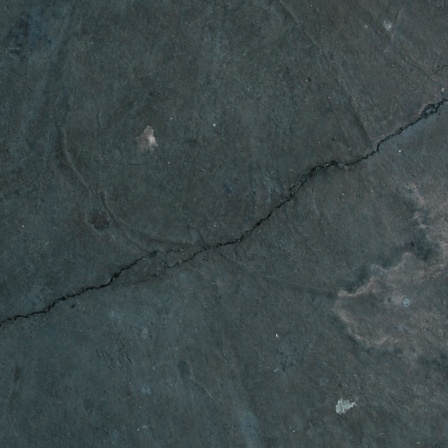

# Crack segmentation based self-cross pseudo supervision with generative image inpainting model

This repo is the pytorch implementation of the following paper:

The detailed paper will be updated when the publication is completed.

This paper presents an algorithm for detecting cracks in aging concrete using a small amount of training data. Contrary to the conventional belief that extensive and diverse training data is required to develop a model, this study proposes a method utilizing generative AI to detect cracks even with limited data. To implement this approach, data was divided into training (15%), validation (15%), and testing (70%) sets. In real-world settings, obtaining large amounts of data from the field is challenging, which underscores the need for effective methods with minimal data. The proposed algorithm is configured in two main stages: crack image generation and network model training. In the first stage, DreamBooth was applied to fine-tune a generative AI model (Ruiz et al., 2023)([Link](https://arxiv.org/abs/2208.12242)) for generating crack images. Unlike popular text-to-image generation, an inpainting technique was used to control crack areas flexibly using mask images. This approach allowed for synthesizing diverse crack images. As this crack generation method is not a core contribution of the study, the code for this step is not provided. The next stage introduces a novel training structure for the segmentation network. Since crack images were generated using inpainting, the mask image may be used as a label image. Although the generated crack images are of high photorealistic quality, they may be not flawless. To address this, a new training structure was proposed to compensate for any imperfections in the generated data. This approach was tested on 10 network models, resulting in an accuracy improvement of up to 14.91%.


The full dataset is provided by Bianchi, Eric; Hebdon, Matthew (2021). Concrete Crack Conglomerate Dataset. University Libraries, Virginia Tech. Dataset. This dataset can be download at ([Link](https://data.lib.vt.edu/articles/dataset/Concrete_Crack_Conglomerate_Dataset/16625056)). This code has been implemented to operate using sample from original data. 


## Prerequisite

* CUDA 12.1
* pytorch == 2.3.1 
* python-opencv == 4.10.0.84
* accelerate == 0.31.0

## Installation
```bash
git clone https://github.com//phylun/SCPSCrack.git
```

## Download dataset
Download the sample dataset via the link ([Link](https://drive.google.com/file/d/1Khf8buAuOMFUNsT1SrEiQOBb0gDUY8Ps/view?usp=sharing)). Unzip it into the folder `SCPS_Dataset`
```
SCPS_Dataset/trainConc/JPEGImages
                      /SegmentationClass
            /testConc/JPEGImages
                      /SegmentationClass
            /inpaintConc/JPEGImages
                        /SegmentationClass              
```

## Training on sample dataset

If you want to check whether the code is work, run shell script below

```
sh script/run_SCPS_SegTrain.sh
```

Otherwise, you can specify running condition and parameters in details. Please refer to script line below. Note that '--inpainting' option should be activated to include generated crack images .
```
accelerate launch --multi_gpu --main_process_port=29559 accelerate_SelfCPS_SegTrain.py \
    --name CPSInpaintCrack_PoolFormerS36_SD21 --mixed_precision 'bf16' \
    --Snet 'PoolformerS36' --inpainting --with_tracking
```

Use your own project name (e.g. CPSInpaintCrack_ConvNeXtT). Snet means segmenation model. In this code, ten models are provided such as CGNet, FDDWNet, ERFNet, DDRNet, RegSeg, ConvNeXt(T or S), PoolFormer(S24 or S36) and SwinFormerT. 

The proposed training structure is called self-cross pseudo supervision, which combines self-supervision and pseudo supervision. To use only self-supervision, the `--csp_weight 0` option can be applied, while to apply pseudo supervision alone, the `--cps_weight 1` option should be added. Please refer to scripts below

In case of supervised learning, use the below script
```
# for self-supervised learning 
accelerate launch --multi_gpu --main_process_port=29559 accelerate_SelfCPS_SegTrain.py \
    --name CPSInpaintCrack_PoolFormerS24 --mixed_precision 'bf16' \
    --Snet 'PoolformerS24' --inpainting --with_tracking --cps_weight 1

# for cross pseudo supervised learning 
accelerate launch --multi_gpu --main_process_port=29559 accelerate_SelfCPS_SegTrain.py \
    --name CPSInpaintCrack_PoolFormerS24 --mixed_precision 'bf16' \
    --Snet 'PoolformerS24' --inpainting --with_tracking --cps_weight 0
```

## Evaluate the segmentation model on sample dataset
```
python accelerate_SegTest.py --name CPSInpaintCrack_PoolFormerS36_SD21 --Snet PoolformerS36
```
This script evaluates the accuracy for all saved models in the folder `outputs/project_name` with `testConc`. When the option of `--best_epoch 100`, then 100th saved model is called and C-IoU and F1 is assessed. 


## Generated crack images by generative inpainting model (Dreambooth-inpainting)

<table>
  <tr>
    <td></td>
    <td></td>
    <td></td>
    <td></td>
    <td></td>
  </tr>
  <tr>
    <td></td>
    <td></td>
    <td></td>
    <td></td>
    <td></td>
  </tr>
  <tr>
    <td></td>
    <td></td>
    <td></td>
    <td></td>
    <td></td>
  </tr>
  <tr>
    <td></td>
    <td></td>
    <td></td>
    <td></td>
    <td></td>
  </tr>
</table>


## Changelog
* November 08th, 2024: Updated by author
